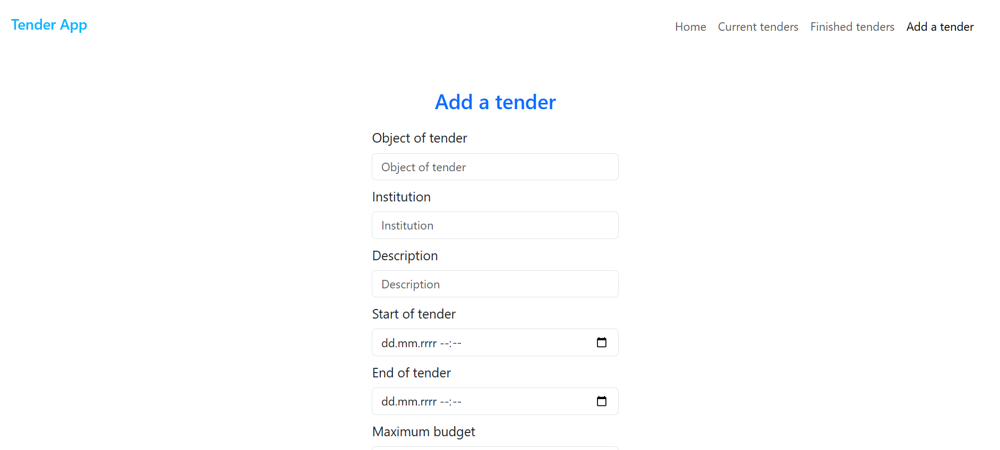

# TendersApp

To start an app:
**npm run dev**

**Endpoints**

✅ **GET /** - main site containing:
* menu with: 
    * main
    * tenders list **/tenders**
    * finished tenders list **/tenders/finished**
    * add a tender
* system description

✅ **GET /tenders** - list of current tenders: 
* ordinal number
* tender's title (after click - **/tenders/[tender_id]**)
* date and time of tender's start
* date and time of tender's end

✅ **GET /tenders/[tender_id]**:
* Tender description
* Institution
* Button **extend an offer** only for current tenders
* Sorted list of offers (by price) and filtered: only offer not exceeding a budget (if offer list empty and tender is finished: **tender is not decided**, if not started then information that tender has not start yet)

✅ **GET /tenders/offer/id** - contains form with:
* name (type : text)
* offer value (type : number)
* button **extend an offer** (after click, form updates a tender with automatic date and time of start)

✅ **POST /tenders/offer/id** - updates a tender

✅ **GET /tenders/finished** - list of finished tenders with information about end without dates

✅ **GET /tenders/add** - add a new tender form: 
* object of tender
* institution
* description
* date and time of start
* date and time of end
* max budget (not avaible in table in **/**)

✅ **POST /tenders/add** - a new tender to database

## **Demo**

